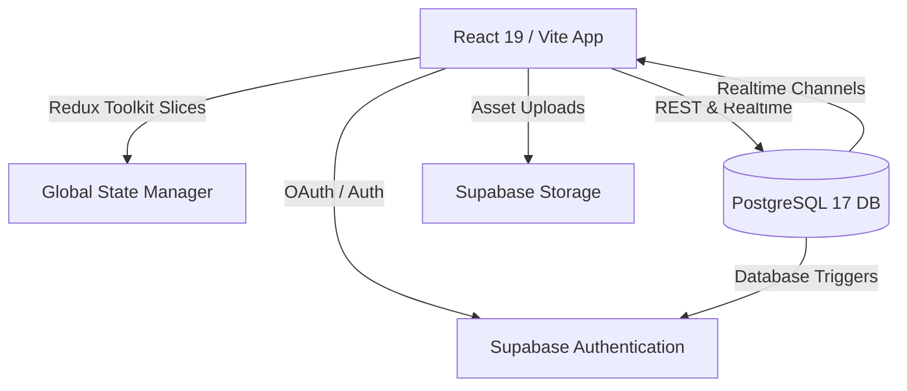
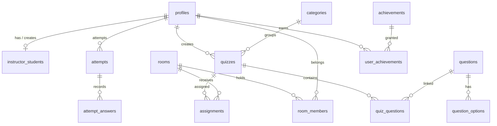

# 🚀 Quivio — QuizMaster Pro

[](https://react.dev/)
[](https://vite.dev/)
[](https://redux-toolkit.js.org/)
[](https://supabase.com/)
[](https://www.postgresql.org/)

**Quivio — QuizMaster Pro** is a premium, next-generation gamified online assessment and classroom management system. Architected for both instructors and students, it delivers an immersive, real-time testing experience combined with robust class analytics, digital certificate generation, automated grading, and social gamification (XP, levels, streaks, and leaderboards).

🧑‍💻 **Developer:** [Mohamed Emad Fayed](https://github.com/Fayed12)

---

## 📖 Table of Contents

1. [🌟 Key Highlights & Features](#-key-highlights--features)
2. [🛠️ Tech Stack & Architecture](#️-tech-stack--architecture)
3. [📂 Directory Structure](#-directory-structure)
4. [📂 Database Schema & Entity Relations](#-database-schema--entity-relations)
5. [🔄 Workflows & Core Logic](#-workflows--core-logic)
    - [Authentication & Access Control](#1-authentication--access-control)
    - [Interactive Quiz-Taking Engine](#2-interactive-quiz-taking-engine)
    - [Gamification, XP & Leaderboard Logic](#3-gamification-xp--leaderboard-logic)
    - [Rooms, Assignments & Notifications](#4-rooms-assignments--notifications)
6. [💻 Installation & Environment Setup](#-installation--environment-setup)
7. [🚀 Building & Deployment](#-building--deployment)
8. [🤝 Contributing & License](#-contributing--license)

---

## 🌟 Key Highlights & Features

### 👨‍🏫 For Instructors
*   **Quiz Creation Engine:** Design highly customizable quizzes with MCQs and True/False questions. Features include image attachment, points configuration, difficulty grading, question/answer shuffling, custom passing scores, and availability dates.
*   **Student Account Management:** Create student accounts one by one or utilize **Bulk CSV Import** with automatic client-side format validation.
*   **Real-time Room Management:** Group students into classroom rooms, assign quizzes directly to rooms, and monitor progress live.
*   **Comprehensive Analytics Dashboard:** Drill down into class performance, check student averages, pass rates, attempt distributions, and view overall statistics powered by [Recharts](https://recharts.org/).
*   **Digital Certificates:** Design and enable automatic PDF certificate generation for students who successfully pass quizzes.

### 🎓 For Students
*   **Gamified Dashboard:** View current XP, levels, active daily streaks (with a 7-day calendar widget), recent activity, and pending assignments.
*   **Real-time Leaderboards:** Compete on Global, Monthly, and Category-based leaderboards with a fully responsive 3D podium for top ranks.
*   **Quiz Browse & Detail:** Filter quizzes by category, difficulty, duration, bookmarks, and status. View historical attempts and stats before starting a quiz.
*   **Immersive Quiz Engine:** Mono-spaced countdown timers, an interactive question navigator grid, flag questions for review, view hints, and benefit from **2-second auto-save** to database or localStorage fallback. Includes high-fidelity sound effects!
*   **Detailed Results & Verification:** View incorrect vs. correct answers with optional detailed instructor explanations, earn XP bonuses, watch level-up animations, and download verified PDF certificates.
*   **Public Certificate Verification:** A public verification search page where third parties can input a certificate code to verify its authenticity and view the performance card.

---

## 🛠️ Tech Stack & Architecture

Quivio is engineered as a robust Single Page Application (SPA) utilizing a modern decoupled frontend connected to a cloud-hosted serverless backend.



### Frontend Architecture
*   **Framework:** **React 19** with Vite for blazing-fast HMR and build performance.
*   **State Management:** **Redux Toolkit** (configured with slices mirroring Supabase tables).
*   **Styling & UI:** **Material UI (MUI v9)** components combined with a highly responsive, custom-crafted CSS Variables System supporting seamless Dark and Light themes.
*   **Animations:** **GSAP (GreenSock Animation Platform)** for ultra-smooth page transitions and gamified modals.
*   **Client PDF Render:** **`@react-pdf/renderer`** generates high-fidelity, printable PDF certificates dynamically.
*   **Audio Engine:** **`Howler.js`** provides low-latency, immersive audio feedback for interactive quiz states (selection, next, flag, submit, timer tick, hint).
*   **Analytics Visualization:** **`Recharts`** renders vector charts for students' and instructors' dashboard stats.

### Backend Infrastructure
*   **Service Provider:** **Supabase**
*   **Database:** **Postgres 17** with Row Level Security (RLS) policies enforced.
*   **Realtime Features:** Supabase Realtime Channels for automatic database-to-frontend synchronization.
*   **Authentication:** Supabase Auth (Instructor self-registration & Student Edge-Function creation).
*   **Storage:** Supabase Storage buckets for custom avatars and quiz cover images.

---

## 📂 Directory Structure

A look at the structural layout of the source repository:

```text
├── guide-files              # PDF, Database guides & workflows
├── public                   # Static assets, logos, and sounds
└── src
    ├── App.jsx              # Main App wrapper hosting RealtimeProviders
    ├── index.css            # Core CSS variables, resets, and utility classes
    ├── main.jsx             # React DOM root entry
    ├── components           # Shared custom UI components
    │   └── ui               # Buttons, inputs, spinners, selects
    ├── hooks                # Custom React & Realtime subscription hooks
    │   └── instructor       # Page animations, analytics, and detail data hooks
    ├── layouts              # Layout shells (Instructor / Student Protected viewports)
    ├── pages                # Main application screens
    │   ├── authentication   # Login, register, forgot-password, reset-password
    │   ├── error-page       # 404 & boundary errors
    │   ├── instructor       # Instructor workspace (analytics, quizzes, rooms, students)
    │   ├── student          # Student workspace (dashboard, attempts, quizzes, leaderboard)
    │   └── landing-page     # Public-facing home landing page
    ├── redux                # Redux Toolkit store & feature slices
    │   ├── store.js
    │   └── slices
    ├── router               # React Router configurations & lazy-loaded pages
    └── services             # API service layers
        └── config           # Supabase client configurations
```

---

## 📂 Database Schema & Entity Relations

Quivio relies on a highly normalized relational Postgres schema. Security is strictly enforced using **Row Level Security (RLS)** and automated PostgreSQL triggers.



### Table Reference Summary
1.  **`profiles`**: User data for both students and instructors, linked 1:1 to `auth.users` via `uid`. Tracks gamification elements (`xp`, `level`, `streak`).
2.  **`instructor_students`**: Enforces account ownership, tracking which instructor created which student (security validation for management).
3.  **`categories`**: Quiz and question tags with customized icons and colors.
4.  **`quizzes`**: Quiz configurations (time limits, passing scores, difficulty levels, active draft/published states).
5.  **`questions` & `question_options`**: Dynamic question bank supporting multiple choice (MCQ) or True/False options.
6.  **`rooms` & `room_members`**: Classroom groupings managed by instructors.
7.  **`assignments`**: Assigns specific quizzes to class rooms with custom start/due date boundaries.
8.  **`attempts` & `attempt_answers`**: Student attempt logs, recording selected options, final grades, and timestamps.
9.  **`certificates`**: Secure records representing passed attempts, with validation hash codes.
10. **`achievements` & `user_achievements`**: Gamification achievements (e.g., Bronze, Silver, Gold tiers) unlocked via triggers.

---

## 🔄 Workflows & Core Logic

### 1. Authentication & Access Control
```
Instructors (Self-Register) ──────────> Email Verification ──> Full Dashboard
Students (No Self-Register) ───> Created by Instructor ───> Password Reset (Forced on 1st Login) ───> Room Assignment Check
```
*   **Instructor Registration:** Instructors self-register through `/register`. This triggers an entry in `public.profiles` via database triggers, requiring verification before access.
*   **Student Account Provisioning:** Instructors generate student credentials. An Admin Edge Function generates a secure random password, creates the profile record, links the student to the instructor in `instructor_students`, and emails the student.
*   **First-Time Login:** On initial authentication, the student profile forces redirection to `/reset-password` if `must_change_password` is set to `true`.
*   **Room Locking (Limited State):** If a student logs in but has not yet been assigned to a classroom `room`, they enter a "limited state" where dashboard stats are placeholder values and all pages except public quizzes are locked.

---

### 2. Interactive Quiz-Taking Engine
The core testing experience is heavily optimized for zero data loss and high engagement:
*   **Audio Atmosphere:** Custom audio cues powered by `Howler.js` play on select/next/flag/hint actions, creating a gamified and focused test environment.
*   **Continuous Saving (Autosave):** The frontend debounces answers and triggers an background auto-save to the Supabase database every 2 seconds. If a connection drop occurs, the engine automatically saves to the student's `localStorage` and alerts the UI with a "Saving locally..." indicator.
*   **Seeded Answer Shuffling:** If a quiz requires shuffled questions or options, a seeded shuffle algorithm uses the student's attempt ID as the seed. This ensures option orders remain consistent if the student refreshes their browser page during the quiz.
*   **Hard Submission Rules:** When the `time_remaining` reaches zero, the client triggers `submitAttemptThunk()`. This saves all final answers, flags unfinished questions, computes scores, and terminates the session immediately.

---

### 3. Gamification, XP & Leaderboard Logic
Quivio features an automated gamification pipeline to encourage student engagement:

#### Level and XP Computation
Students earn XP by completing quiz attempts. Points are awarded based on performance:
$$\text{XP Earned} = \text{Quiz Attempt Score} \times 1.5 + (\text{Time Saved Bonus}) + (\text{First Attempt Bonus})$$
When a profile's XP exceeds the threshold, the level increments automatically. Level thresholds scale quadratically:
$$\text{XP Required for Level } N = 100 \times N^2$$

#### Streaks
Streaks are updated daily. An automated database function compares the student's `last_activity_date`. If the current date is consecutive, the streak increases and updates `longest_streak`. If a student misses a consecutive day, the streak resets to `0`.

#### Real-time Leaderboards
Global, Monthly, and Category-based leaderboards listen to the `profiles` table. Any XP change triggers an instant animation in the leaderboard list, adjusting ranks in real-time.

---

### 4. Rooms, Assignments & Notifications
*   **Class Rooms:** Instructors group student pools into rooms. Changing room memberships dynamically grants or revokes visibility of private quizzes.
*   **Quizzes to Rooms (Assignments):** Instructors schedule assignments. A student receives real-time UI notifications the moment a quiz becomes available, or an alert if a quiz is nearing its due date.
*   **In-App Alerts:** The application shell triggers floating Toastify banners and custom SweetAlert2 modals for newly earned achievements or classroom announcements.

---

## 💻 Installation & Environment Setup

Follow these steps to run Quivio locally on your computer.

### Prerequisites
*   [Node.js](https://nodejs.org/) (v18.0.0 or higher recommended)
*   [npm](https://www.npmjs.com/) or [yarn](https://yarnpkg.com/)
*   A [Supabase](https://supabase.com/) account (to host the backend)

### 1. Clone the Repository
```bash
git clone https://github.com/Fayed12/Quivio-web-app.git
cd 15-Quivio-web-app
```

### 2. Install Project Dependencies
Use `npm` to install required dependencies:
```bash
npm install
```

### 3. Configure Environment Variables
Create a `.env` file in the root directory. You can copy the values from `.env.example`:
```bash
cp .env.example .env
```

Open `.env` and fill in your Supabase project credentials:
```env
# Supabase Keys
VITE_SUPABASE_URL=https://your-project-id.supabase.co
VITE_SUPABASE_ANON_KEY=your-anon-key-here

# App URL
VITE_APP_URL=http://localhost:5173
```

### 4. Run the Development Server
Launch the local Vite server:
```bash
npm run dev
```

The application will start, usually at [http://localhost:5173](http://localhost:5173).

---

## 🚀 Building & Deployment

### Build for Production
To generate a production-ready static bundle:
```bash
npm run build
```
This compiles assets into the `dist/` directory, optimized with code-splitting, tree-shaking, and the React Compiler enabled.

### Preview Local Build
Verify the production build locally before hosting:
```bash
npm run preview
```

### Hosting on Vercel
The repository includes a `vercel.json` file configured to handle SPA routing redirects (`/*` to `/index.html`). To deploy:
1. Connect your repository to [Vercel](https://vercel.com).
2. Configure environmental variables (`VITE_SUPABASE_URL` and `VITE_SUPABASE_ANON_KEY`) in the Vercel dashboard.
3. Deploy!

---

## 🤝 Contributing & License

### Contributions
Contributions are welcome! Please open an issue or submit a pull request if you want to add features or report bugs. 

For major changes, please open an issue first to discuss what you would like to change.

### License
This project is licensed under the MIT License. See the [LICENSE](file:///d:/study/react/Projects/15-Quivio-web-app/LICENSE) file for more information (if applicable).

---
