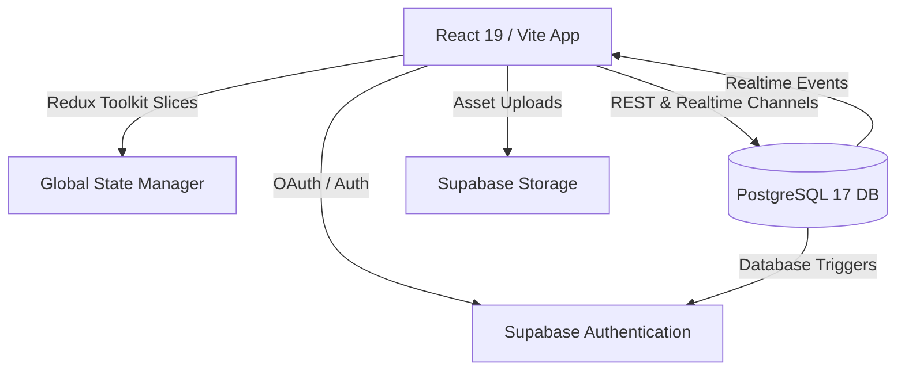
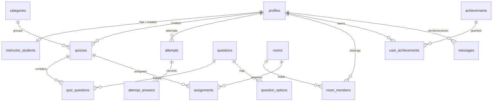

# 🚀 Quivio — QuizMaster Pro

[](https://quivio-web-app.vercel.app/)
[](https://react.dev/)
[](https://vite.dev/)
[](https://redux-toolkit.js.org/)
[](https://supabase.com/)
[](https://www.postgresql.org/)

**Quivio — QuizMaster Pro** is a premium, next-generation gamified online assessment and classroom management system. Architected for both instructors and students, it delivers an immersive, real-time testing experience combined with robust class analytics, digital certificate generation, automated grading, direct student-instructor messaging, and social gamification (XP, levels, streaks, and 3D leaderboards).

🌐 **Production Web App**: [https://quivio-web-app.vercel.app/](https://quivio-web-app.vercel.app/)  
🧑‍💻 **Developer:** [Mohamed Emad Fayed](https://github.com/Fayed12)

---

## 📖 Table of Contents

1. [🌟 Key Highlights & Features](#-key-highlights--features)
2. [🛠️ Tech Stack & Architecture](#️-tech-stack--architecture)
3. [📂 Directory Structure](#-directory-structure)
4. [📂 Database Schema & Entity Relations](#-database-schema--entity-relations)
5. [🔄 Workflows & Core Logic](#-workflows--core-logic)
    - [Authentication & Access Control](#1-authentication--access-control)
    - [Interactive Quiz-Taking Engine](#2-interactive-quiz-taking-engine)
    - [Gamification, XP & Leaderboard Logic](#3-gamification-xp--leaderboard-logic)
    - [Rooms, Assignments & Realtime Communication](#4-rooms-assignments--realtime-communication)
6. [💻 Installation & Environment Setup](#-installation--environment-setup)
7. [🚀 Building & Deployment](#-building--deployment)
8. [🤝 Contributing & License](#-contributing--license)

---

## 🌟 Key Highlights & Features

### 👨‍🏫 For Instructors
*   **Interactive Exam & Quiz Engine:** Design highly customizable quizzes featuring Multiple Choice (MCQs) and True/False questions, image attachments, points allocation, difficulty grading, question/answer shuffling, custom passing thresholds, and time windows.
*   **Centralized Question Banks:** Create and curate reusable question repositories categorized by subject tags, allowing instant test composition without re-typing.
*   **Student Account Provisioning & Bulk CSV Import:** Provision individual student accounts with auto-generated secure credentials or upload an entire classroom cohort at once using **Bulk CSV Import** with real-time format checking.
*   **Classroom Rooms & Assignments:** Group students into isolated classroom rosters, schedule assignment start and due date boundaries, and track real-time submission progress.
*   **Comprehensive Recharts Analytics:** Drill down into class performance, pass rates, score deciles, question difficulty ratios, student average scores, and export statistical reports directly to **Excel (.xlsx)**.
*   **Realtime Chat & Classroom Broadcasts:** Communicate directly with students via 1-on-1 direct messaging and send room-wide announcement broadcasts powered by Supabase Realtime.
*   **Automatic PDF Certificates:** Enable automatic client-side PDF certificate generation for passing students, embedded with unique 8-character verification hash codes.

### 🎓 For Students
*   **Gamified Dashboard & Category Performance:** Track overall XP, quadratic levels, active daily streaks (with a 7-day calendar widget), recent activity, pending assignments, and broken-down **Category Performance** metrics.
*   **Real-time Social Leaderboards:** Compete on Global, Monthly, and Category-based leaderboards complete with interactive 3D podiums for top ranks.
*   **Interactive Quiz-Taking Experience:** Features mono-spaced countdown timers, an interactive question navigator grid, question review flagging, hint reveals, sound effects (via `Howler.js`), and **2-second auto-save** (with local cache fallback).
*   **Detailed Step-by-Step Explanations:** Review past attempt breakdown showing correct vs. incorrect answers alongside instructor explanations.
*   **Public Certificate Validator:** Third parties, employers, and academic institutions can verify certificate authenticity publicly via `/verify/:code`.
*   **In-App Realtime Notifications:** Receive toast notifications and floating banners for newly unlocked achievements, incoming classroom messages, and approaching quiz due dates.

---

## 🛠️ Tech Stack & Architecture

Quivio is engineered as a robust Single Page Application (SPA) utilizing a modern decoupled frontend connected to a cloud-hosted serverless backend.


```mermaid
graph TD
    Client[React 19 / Vite App] -->|OAuth / Auth| SupabaseAuth[Supabase Authentication]
    Client -->|Redux Toolkit Slices| Redux[Global State Manager]
    Client -->|REST & Realtime Channels| SupabaseDB[(PostgreSQL 17 DB)]
    Client -->|Asset Uploads| SupabaseStorage[Supabase Storage]
    SupabaseDB -->|Database Triggers| SupabaseAuth
    SupabaseDB -->|Realtime Events| Client
```

### Frontend Architecture
*   **Framework:** **React 19** with Vite for blazing-fast HMR and build performance.
*   **State Management:** **Redux Toolkit** (configured with slices mirroring Supabase tables).
*   **Styling & UI:** **Material UI (MUI v9)** combined with a custom CSS Variables design system supporting seamless Dark and Light themes and modern responsive layouts.
*   **Animations:** **GSAP (GreenSock Animation Platform)** for smooth page entrance effects, scroll triggers, and gamified modals.
*   **Client PDF Render:** **`@react-pdf/renderer`** generates high-fidelity, printable PDF certificates dynamically.
*   **Audio Atmosphere Engine:** **`Howler.js`** provides low-latency, immersive audio feedback for interactive quiz states (select, next, flag, submit, timer tick, hint reveal).
*   **Analytics Visualization:** **`Recharts`** renders vector charts for student and instructor dashboards.
*   **Data Exporter:** **`xlsx`** library generates statistical spreadsheet files directly in the browser.

### Backend Infrastructure
*   **Service Provider:** **Supabase**
*   **Database:** **Postgres 17** with Row Level Security (RLS) policies enforced.
*   **Realtime Features:** Supabase Realtime Channels for instant chat messaging and notification sync.
*   **Authentication:** Supabase Auth (Instructor registration & Student account management).
*   **Storage:** Supabase Storage buckets for custom avatars and quiz cover imagery.

---

## 📂 Directory Structure

A look at the structural layout of the source repository:

```text
├── guide-files              # Database schema & workflow reference guides
├── public                   # Static assets, logos, hero image, and sounds
└── src
    ├── App.jsx              # App entry point with RealtimeProviders
    ├── index.css            # Core CSS variables, resets, and utility classes
    ├── main.jsx             # React DOM root entry
    ├── components           # Shared custom UI components
    │   └── ui               # Buttons, inputs, spinners, selects
    ├── hooks                # Custom React & Realtime subscription hooks
    │   └── instructor       # Page animations, analytics, and detail data hooks
    ├── layouts              # Protected viewport layouts (Instructor & Student)
    ├── pages                # Main application screens
    │   ├── authentication   # Login, register, forgot-password, reset-password
    │   ├── error-page       # 404 & error boundary pages
    │   ├── instructor       # Instructor workspace (analytics, question bank, quizzes, rooms, students, chat)
    │   ├── student          # Student workspace (dashboard, attempt runner, quizzes, leaderboard, chat, notifications)
    │   ├── landing-page     # Public hero landing page & features showcase
    │   └── welcome-page     # Onboarding landing gateway
    ├── redux                # Redux Toolkit store & feature slices
    │   ├── store.js
    │   └── slices
    ├── router               # React Router configurations & lazy-loaded routes
    └── services             # API service layers & Supabase client config
```

---

## 📂 Database Schema & Entity Relations

Quivio relies on a highly normalized relational Postgres schema. Security is strictly enforced using **Row Level Security (RLS)** and automated PostgreSQL triggers.


```mermaid
erDiagram
    profiles ||--o| instructor_students : "has / creates"
    profiles ||--o{ quizzes : "creates"
    profiles ||--o{ attempts : "attempts"
    categories ||--o{ quizzes : "groups"
    quizzes ||--o{ quiz_questions : "contains"
    questions ||--o{ quiz_questions : "linked"
    questions ||--o{ question_options : "has"
    rooms ||--o{ room_members : "holds"
    profiles ||--o{ room_members : "belongs"
    quizzes ||--o{ assignments : "assigned"
    rooms ||--o{ assignments : "receives"
    profiles ||--o{ user_achievements : "earns"
    achievements ||--o{ user_achievements : "granted"
    attempts ||--o{ attempt_answers : "records"
    profiles ||--o{ messages : "sends/receives"
```

### Table Reference Summary
1.  **`profiles`**: User data for both students and instructors, linked 1:1 to `auth.users` via `uid`. Tracks gamification elements (`xp`, `level`, `streak`).
2.  **`instructor_students`**: Enforces account ownership, tracking which instructor created which student.
3.  **`categories`**: Quiz and question tags with customized icons and colors.
4.  **`quizzes`**: Quiz configurations (time limits, passing scores, difficulty levels, active draft/published states).
5.  **`questions` & `question_options`**: Question bank supporting Multiple Choice (MCQs) and True/False options.
6.  **`rooms` & `room_members`**: Classroom groupings managed by instructors.
7.  **`assignments`**: Assigns specific quizzes to class rooms with custom start/due date boundaries.
8.  **`attempts` & `attempt_answers`**: Student attempt logs, recording selected options, final grades, and timestamps.
9.  **`certificates`**: Secure records representing passed attempts with 8-character verification codes.
10. **`messages`**: Real-time 1-on-1 and room broadcast messaging.

---

## 🔄 Workflows & Core Logic

### 1. Authentication & Access Control
```
Instructors (Self-Register) ──────────> Email Verification ──> Full Admin Workspace
Students (No Self-Register) ───> Provisioned by Instructor ───> Password Reset (Forced 1st Login) ───> Room Assignment Check
```
*   **Instructor Registration:** Instructors self-register through `/register`. This creates a profile record requiring verification before full access.
*   **Student Account Provisioning:** Instructors generate student credentials either individually or via CSV file import.
*   **First-Time Login:** On initial login, students with `must_change_password: true` are prompted to update their password.
*   **Room Locking:** Students awaiting classroom room placement see customized guidance until assigned to an active room.

---

### 2. Interactive Quiz-Taking Engine
*   **Audio Atmosphere:** Custom sound cues powered by `Howler.js` play on select/next/flag/hint actions.
*   **Continuous 3-Second Autosave:** Answer selections are debounced and synced to the database every 3 seconds. In case of network loss, answers are cached in browser `localStorage` and automatically restored on the next session.
*   **Seeded Answer Shuffling:** A deterministic shuffle algorithm uses the student's attempt ID as seed, maintaining consistent option order across browser reloads.
*   **Auto-Submit:** When countdown timers reach zero, `submitAttemptThunk()` automatically calculates final scores and terminates the session.

---

### 3. Gamification, XP & Leaderboard Logic
Students earn XP by completing quiz attempts:
$$\text{XP Earned} = \text{Attempt Score} \times 1.5 + (\text{Time Saved Bonus}) + (\text{First Attempt Bonus})$$
Level thresholds scale quadratically:
$$\text{XP Required for Level } N = 100 \times N^2$$

#### Daily Streaks & Leaderboards
Streaks update based on daily activity (`last_activity_date`). Real-time leaderboards feature 3D podiums for top ranks.

---

### 4. Rooms, Assignments & Realtime Communication
*   **Classrooms & Assignments:** Instructors assign quizzes to rooms with custom start/due windows.
*   **Realtime Chat & Alerts:** In-app messaging and broadcast announcements sync instantly across connected clients via Supabase Realtime.

---

## 💻 Installation & Environment Setup

### Prerequisites
*   [Node.js](https://nodejs.org/) (v18.0.0 or higher)
*   [npm](https://www.npmjs.com/)
*   A [Supabase](https://supabase.com/) project

### 1. Clone the Repository
```bash
git clone https://github.com/Fayed12/Quivio-web-app.git
cd 15-Quivio-web-app
```

### 2. Install Dependencies
```bash
npm install
```

### 3. Configure Environment Variables
Copy `.env.example` to `.env`:
```bash
cp .env.example .env
```
Provide your Supabase URL and Anon Key:
```env
VITE_SUPABASE_URL=https://your-project-id.supabase.co
VITE_SUPABASE_ANON_KEY=your-anon-key-here
VITE_APP_URL=http://localhost:5173
```

### 4. Run Development Server
```bash
npm run dev
```

---

## 🚀 Building & Deployment

### Build for Production
```bash
npm run build
```
Compiles static assets into the `dist/` directory with code splitting and tree shaking.

### Preview Production Build
```bash
npm run preview
```

### Deploying to Vercel
The app is live in production:
👉 **Live URL**: [https://quivio-web-app.vercel.app/](https://quivio-web-app.vercel.app/)

---

## 🤝 Contributing & License

Contributions are welcome! Please open an issue or pull request for suggestions or bug reports.  
Licensed under the [MIT License](LICENSE).
